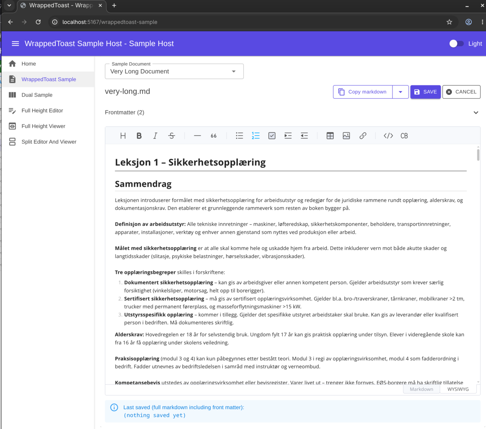
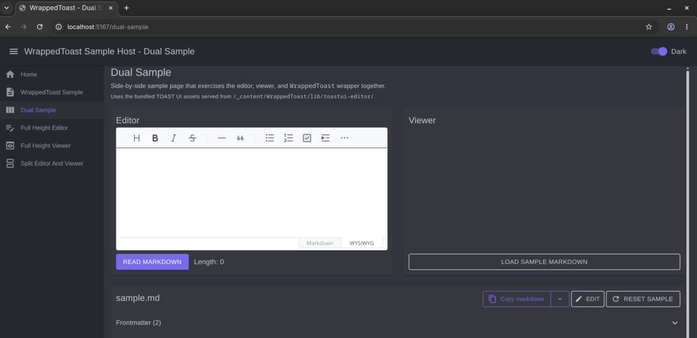
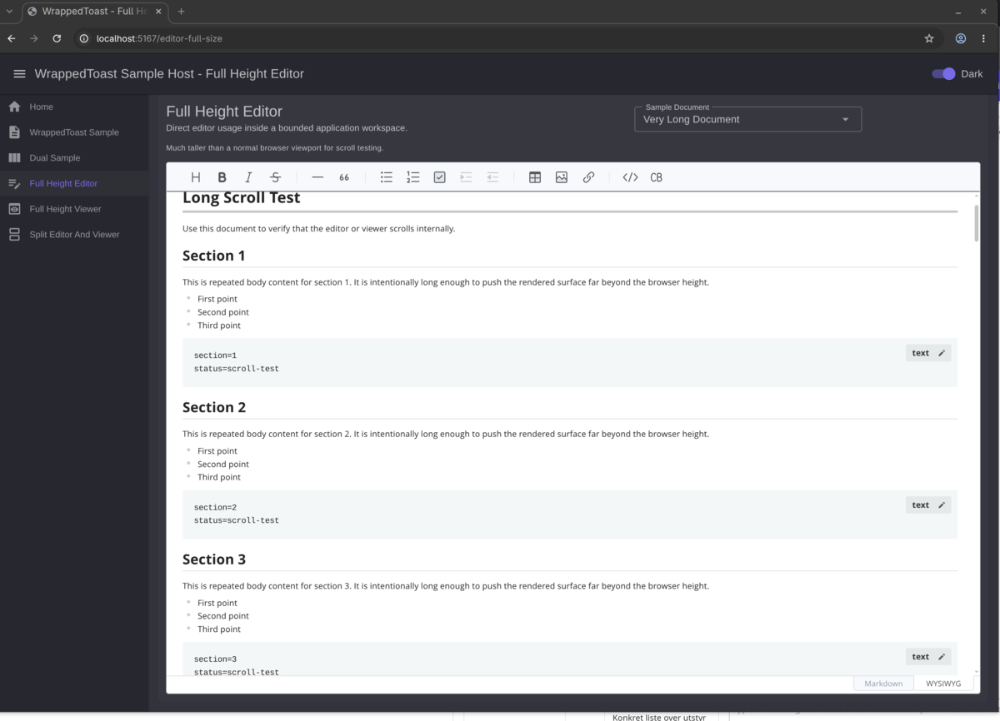

# WrappedToast

- `ToastUIEditor` and `ToastUIEditorViewer`: thin Blazor wrappers around the native TOAST UI JavaScript editor and viewer. They depend on Blazor and the bundled TOAST UI assets only.
- `WrappedToast`: a higher-level MudBlazor component built on top of those thin wrappers.

TOAST UI Editor assets are bundled. No CDN required.


## Projects

- `src/WrappedToast` — reusable Razor class library
- `samples/WrappedToast.SampleHost` — MudBlazor sample application demonstrating all three components in various scenarios
- `samples/ToastUIEditorAndViewerSamples` — plain Blazor sample for `ToastUIEditor` and `ToastUIEditorViewer`. No dependencies except ASP.NET Blazor


## Screenshots


*WrappedToast component in light theme with toolbar and front-matter table.*


*ToastUIEditor and ToastUIEditorViewer in dark theme.*


*Full-height editor layout in dark theme.*


## Assets

- TOAST UI Editor 3.2.2 assets vendored under `wwwroot/lib/toastui-editor/` and served at `/_content/WrappedToast/lib/toastui-editor/...` — no CDN dependency
- Components self-register their CSS/JS via the bundled loader — no host-side wiring needed. The bundled `toastui-loader.js` auto-injects CSS and JS into the page when a component initializes — no `<script>` or `<link>` tags needed in the host app.


## ToastUIEditor / ToastUIEditorViewer - Features

- Thin wrappers around the native TOAST UI Editor and Viewer.
- Constructor options are forwarded through `Options`.
- Straightforward native methods are exposed as Blazor methods. JS callback and DOM-node APIs are intentionally not wrapped as direct C# methods.
- See [API Reference](doc/api-reference.md) for the full method list.


## WrappedToast - Features

- Optional YAML-style `---` front-matter parsed, displayed, and edited inline
- `ToolbarExtras` `RenderFragment` to inject host-specific buttons without coupling the package to host navigation
- Copy-as-markdown and copy-as-HTML toolbar actions
- Programmatic API on WrappedToast: insert, replace, find-and-replace, cursor movement
- Light and dark theme support


## Usage

Choose the component level you need.

### ToastUIEditor / ToastUIEditorViewer Parameters

| Parameter | Type | Default | Description |
|---|---|---|---|
| `InitialStyle` | `string?` | `null` | Inline `style` attribute on the root `<div>` |
| `Options` | `Dictionary<string,string>?` | `null` | Options forwarded to the TOAST UI constructor |


### Using ToastUIEditor or ToastUIEditorViewer

These components do not require MudBlazor.

```razor
@using WrappedToast

<ToastUIEditor InitialStyle="width:100%;height:400px;"
               Options="@(new Dictionary<string,string> { ["initialEditType"] = "wysiwyg" })" />
```

```razor
@using WrappedToast

<ToastUIEditorViewer InitialStyle="width:100%;height:auto;"
                     Options="@(new Dictionary<string,string> { ["height"] = "auto" })" />
```

### Using WrappedToast

`WrappedToast` is a MudBlazor component. Register MudBlazor in the host app:

```csharp
builder.Services.AddMudServices();
```

Include MudBlazor providers in the host layout:

```razor
<MudThemeProvider />
<MudPopoverProvider />
<MudDialogProvider />
<MudSnackbarProvider />
```

```razor
@using WrappedToast

<WrappedToast Title="@FilePath"
              Content="@FileContent"
              OnSave="HandleSaveAsync">
    <ToolbarExtras>
        <MudButton Variant="Variant.Outlined"
                   StartIcon="@Icons.Material.Filled.Print"
                   OnClick="OpenPrintViewAsync">
            Print
        </MudButton>
    </ToolbarExtras>
</WrappedToast>
```

`WrappedToast` parses optional `---` YAML-style front matter from `Content` and displays it as a table above the editor. The full markdown (front matter + body) is delivered back through `OnSave`.

```csharp
private Task HandleSaveAsync(string markdown)
{
    // persist the full markdown (including front matter) here
    return Task.CompletedTask;
}
```

## WrappedToast Parameters

See [API Reference](doc/api-reference.md) for the full method list including programmatic editor APIs.

## Sample

Run the sample from the repository root:

```bash
dotnet run --project samples/WrappedToast.SampleHost
```

Then open the URL printed to the console (typically `https://localhost:5001/`).

The sample demonstrates `ToastUIEditor`, `ToastUIEditorViewer`, and `WrappedToast` including round-trip front-matter editing, the `ToolbarExtras` extension point, and light/dark theme toggling.

For a plain Blazor sample without MudBlazor:

```bash
dotnet run --project samples/ToastUIEditorAndViewerSamples
```

## License and attribution

This package is MIT licensed. It bundles a copy of the TOAST UI Editor (`@toast-ui/editor`), which is also MIT licensed and copyright NHN Cloud Corp. See [`THIRD-PARTY-NOTICES.md`](src/WrappedToast/THIRD-PARTY-NOTICES.md) for the full attribution and license text.
